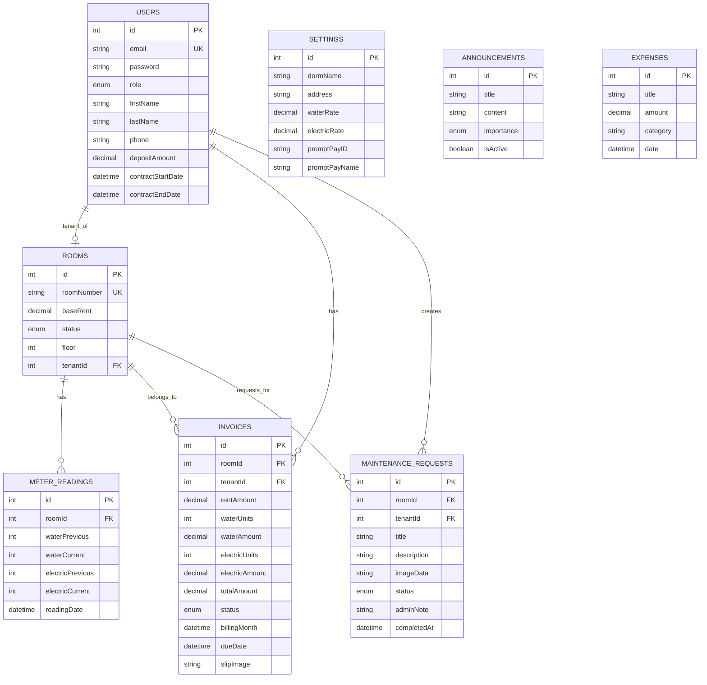

# 📊 ER Diagram - ระบบจัดการหอพัก

## 🏗️ แผนผังฐานข้อมูล (Entity Relationship Diagram)

---

## 📋 รายละเอียดตาราง (Table View)

### 1. User (ผู้ใช้งาน)
เก็บข้อมูลผู้ดูแลระบบ (Admin) และผู้เช่า (Tenant)

| Field | Type | Description | Key |
|-------|------|-------------|-----|
| id | Int | ไอดีผู้ใช้ (Autoincrement) | PK |
| email | String | อีเมลสำหรับ Login | UK |
| password | String | รหัสผ่าน (Hashed) | |
| role | Enum | บทบาท (ADMIN / TENANT) | |
| firstName | String | ชื่อจริง | |
| lastName | String | นามสกุล | |
| phone | String | เบอร์โทรศัพท์ (Optional) | |
| depositAmount | Decimal | เงินประกัน/เงินมัดจำ | |
| contractStartDate | DateTime | วันที่เริ่มสัญญา | |
| contractEndDate | DateTime | วันที่สิ้นสุดสัญญา | |

### 2. Room (ห้องพัก)
เก็บข้อมูลรายละเอียดห้องพักและสถานะปัจจุบัน

| Field | Type | Description | Key |
|-------|------|-------------|-----|
| id | Int | ไอดีห้องพัก | PK |
| roomNumber | String | เลขห้อง | UK |
| baseRent | Decimal | ค่าเช่าพื้นฐาน | |
| status | Enum | สถานะ (AVAILABLE / OCCUPIED / MAINTENANCE) | |
| floor | Int | ชั้นที่อยู่ | |
| tenantId | Int | ไอดีผู้เช่าปัจจุบัน | FK |

### 3. MeterReading (มิเตอร์น้ำ-ไฟ)
บันทึกเลขมิเตอร์ในแต่ละเดือน

| Field | Type | Description | Key |
|-------|------|-------------|-----|
| id | Int | ไอดีรายการบันทึก | PK |
| roomId | Int | ไอดีห้องพัก | FK |
| waterPrevious | Int | เลขมิเตอร์น้ำครั้งก่อน | |
| waterCurrent | Int | เลขมิเตอร์น้ำปัจจุบัน | |
| electricPrevious | Int | เลขมิเตอร์ไฟครั้งก่อน | |
| electricCurrent | Int | เลขมิเตอร์ไฟปัจจุบัน | |
| readingDate | DateTime | วันที่บันทึก | |

### 4. Invoice (ใบแจ้งหนี้/บิล)
ข้อมูลบิลรายเดือนและสถานะการชำระเงิน

| Field | Type | Description | Key |
|-------|------|-------------|-----|
| id | Int | ไอดีบิล | PK |
| roomId | Int | ไอดีห้องพัก | FK |
| tenantId | Int | ไอดีผู้เช่า | FK |
| rentAmount | Decimal | ค่าเช่าห้อง | |
| waterUnits | Int | จำนวนหน่วยน้ำที่ใช้ | |
| waterAmount | Decimal | จำนวนเงินค่าน้ำ | |
| electricUnits | Int | จำนวนหน่วยไฟที่ใช้ | |
| electricAmount | Decimal | จำนวนเงินค่าไฟ | |
| totalAmount | Decimal | ยอดรวมสุทธิ | |
| status | Enum | สถานะ (PENDING / VERIFYING / PAID / REJECTED / OVERDUE) | |
| billingMonth | DateTime | ประจำเดือนของบิล | |
| slipImage | String | หลักฐานการโอนเงิน | |

### 5. MaintenanceRequest (แจ้งซ่อม)
ข้อมูลการแจ้งซ่อมจากผู้เช่า

| Field | Type | Description | Key |
|-------|------|-------------|-----|
| id | Int | ไอดีแจ้งซ่อม | PK |
| roomId | Int | ไอดีห้องพัก | FK |
| tenantId | Int | ไอดีผู้เช่าที่แจ้ง | FK |
| title | String | หัวข้อที่แจ้งซ่อม | |
| description | String | รายละเอียดความเสียหาย | |
| status | Enum | สถานะ (PENDING / IN_PROGRESS / COMPLETED) | |
| adminNote | String | บันทึกจากผู้ดูแล | |

### 6. Settings (ตั้งค่าระบบ)
ตั้งชื่อหอพักและราคาค่าน้ำ-ค่าไฟต่อหน่วย

| Field | Type | Description | Key |
|-------|------|-------------|-----|
| id | Int | ไอดีการตั้งค่า | PK |
| dormName | String | ชื่อหอพัก | |
| waterRate | Decimal | ค่าน้ำต่อหน่วย | |
| electricRate | Decimal | ค่าไฟต่อหน่วย | |
| promptPayID | String | หมายเลขพร้อมเพย์สำหรับรับเงิน | |

### 7. Announcement (ประกาศ)
ข้อมูลประกาศข่าวสารจาก Admin

| Field | Type | Description | Key |
|-------|------|-------------|-----|
| id | Int | ไอดีประกาศ | PK |
| title | String | หัวข้อประกาศ | |
| content | String | เนื้อหาประกาศ | |
| importance | Enum | ความสำคัญ (NORMAL / URGENT) | |
| isActive | Boolean | สถานะการแสดงผล | |

### 8. Expense (ค่าใช้จ่ายหอพัก)
บันทึกรายจ่ายต่างๆ ของหอพัก

| Field | Type | Description | Key |
|-------|------|-------------|-----|
| id | Int | ไอดีรายการจ่าย | PK |
| title | String | รายการค่าใช้จ่าย | |
| amount | Decimal | จำนวนเงิน | |
| category | String | หมวดหมู่ (UTILITIES, MAINTENANCE, ฯลฯ) | |
| date | DateTime | วันที่จ่าย | |

---

## 🔗 ความสัมพันธ์ (Relationship)

| Entity 1 | Relationship | Entity 2 | Description |
|----------|-------------|----------|-------------|
| **User** | 1 : 0..1 | **Room** | ผู้เช่า 1 คน เช่าได้ 1 ห้อง (ในระบบนี้) |
| **User** | 1 : N | **Invoice** | ผู้เช่ามีบิลได้หลายใบ |
| **User** | 1 : N | **MaintenanceRequest** | ผู้เช่าแจ้งซ่อมได้หลายครั้ง |
| **Room** | 1 : N | **MeterReading** | 1 ห้องมีการจดมิเตอร์ทุกเดือน |
| **Room** | 1 : N | **Invoice** | 1 ห้องถูกออกบิลได้หลายใบ |
| **Room** | 1 : N | **MaintenanceRequest** | 1 ห้องมีการแจ้งซ่อมได้หลายรายการ |
